# :page_facing_up: Evaluation 1
## :pencil: Instructions 
**Answer the following questions with Spark DataFrames and Scala using the “CSV” Netflix_2011_2016.csv which is located in the spark-dataframes folder.**

---
## :computer: Development
1. Start a simple Spark session.
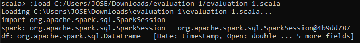
2. Load the Netflix Stock CSV file, have Spark infer the data types.
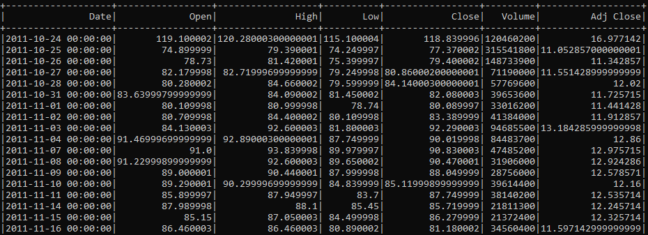
3. What are the names of the columns?
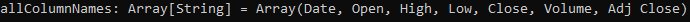
4. How is the scheme?
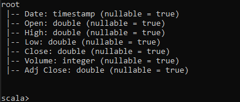
5. Print the first 5 columns.
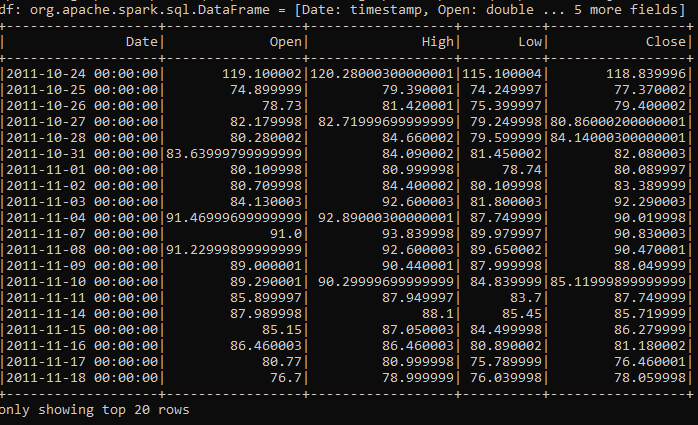
6. Use describe() to learn about the DataFrame.
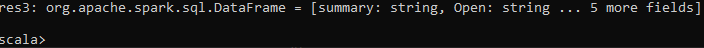
7. Create a new dataframe with a new column called "HV Ratio" which is the ratio that exists between the price of the “High” column versus the “Volume” column of shares traded for one day. Hint - is an operation
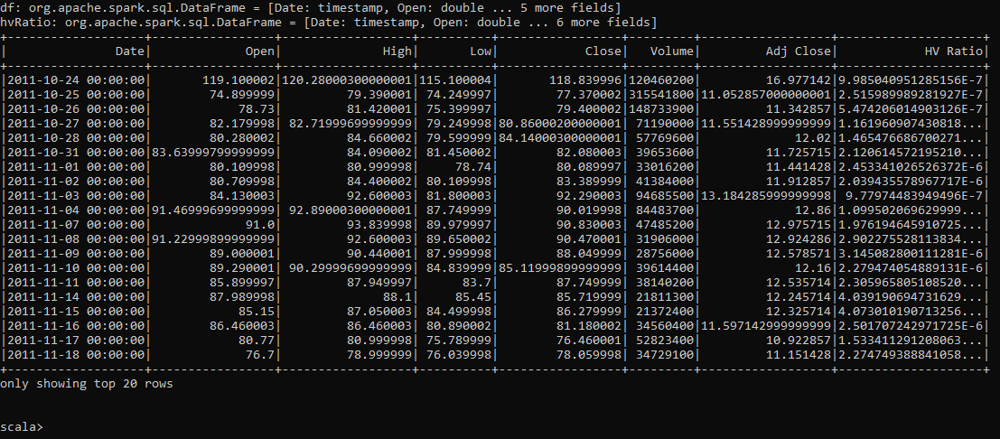
8. Which day had the highest peak in the “Open” column?
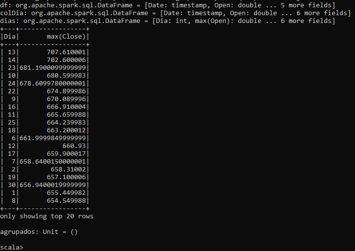
9. What is the meaning of the “Close” column in the context of financial information, explain it, there is no need to code anything?
    >This column refers to the price that the stock or share had at the close of the day, it was the value with which it was being sold
10. What is the maximum and minimum of the “Volume” column?
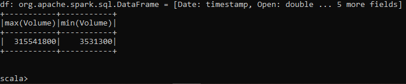

11. With Scala/Spark Syntax $ answer the following:
    + How many days was the “Close” column less than $600?  
    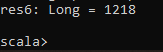
    + What percentage of the time was the "High" column greater than $500?  
    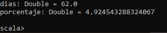
    + What is the Pearson correlation between the “High” column and the “Volume” column?
    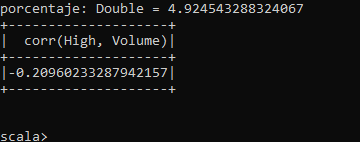
    + What is the maximum of the “High” column per year?
    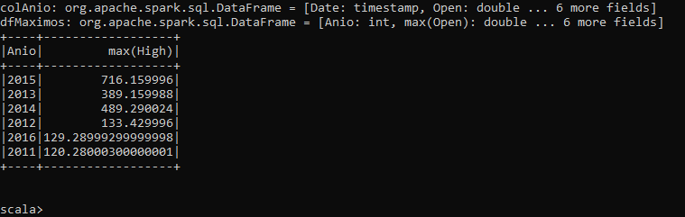
    + What is the average of the “Close” column for each calendar month?
    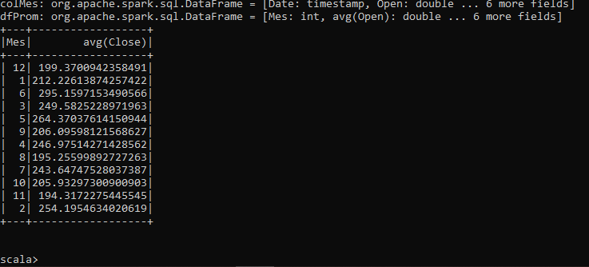