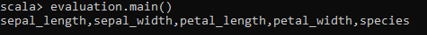
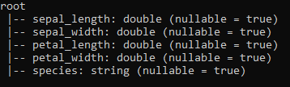
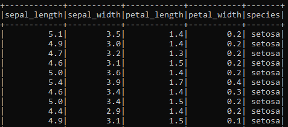
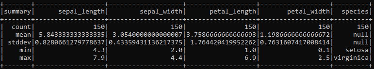

### :necktie: Student
 Name: José Miguel Aguilar López  
 Career: Ing. Sistemas Computacionales

### :necktie: Student
Name: José Ivan Torres Negrete  
Career: Ing. Sistemas Computacionales

### :necktie: Student
Name: Damaris Villegas Carmona  
Career: Ing. Sistemas Computacionales

---
## Instructions
**Develop the following instructions in Spark with the Scala programming language, using only the Spark Machine Learning Mllib documentation and Google.**

**1. Load into a dataframe Iris.csv found in https://github.comjcromerohdz/iris, elaborate the data cleaning necessary to be processed by the following algorithm (Important, this cleaning must be by means of a Scala script in Spark).**

    val data = spark.read.option("header", "true")option("inferSchema","true")csv("C:/Users/JOSEDesktop/evaluation/iris.csv") 

**2. What are the names of the columns?**
      
**3. How is the scheme?**  
      
**4. Print the first 5 columns.?**  
      
**5. Use the describe() method to learn more about the data in the DataFrame.**  
      
**6. Make the pertinent transformation for the categorical data which will be our labels to classify.**

Transform the categorical data to numeric

        val labelIndexer = new StringIndexer().setInputCol("species").setOutputCol("indexedSpecies").fit(data)
        val indexed = labelIndexer.transform(data).withColumnRenamed("indexedSpecies", "label")

In order to avoid error we need to create 2 new columns label and features. Here we create them using StringIndexer and VectorAssembler

    val labelIndexer2 = new StringIndexer().setInputC("label").setOutputCol("indexedSpecies").fit(indexed)
    val assembler = new VectorAssembler().setInputCo(Array("sepal_length","sepal_width","petal_length"petal_width")).setOutputCol("features")
    val  features = assembler.transform(indexed)
**7. Build the classification model and explain its architecture**

Splits the characteristics in 70% training and 30% test

    val splits = features.randomSplit(Array(0.7, 0.3), seed 1234L)
    val train = splits(0)
    val test = splits(1)

Specify layers for the neural network:
input layer of size 4 (features), two intermediate of size 5 and 4 and output of size 3 (classes)

    val layers = Array[Int](4, 5, 4, 3)

Create the trainer and set its parameters

    val trainer = new MultilayerPerceptronClassifier(setLayers(layers).setBlockSize(128).setSeed(1234LsetMaxIter(100)

Train the model

    val model = trainer.fit(train)

Compute accuracy on the test set

    val result = model.transform(test)
    val predictionAndLabels = result.select("prediction", "label")
    val evaluator = new MulticlassClassificationEvaluator().setMetricName("accuracy")

**8. Print the model results**
    
    println(s"Test set accuracy = ${evaluator.evaluate(predictionAndLabels)}")
    spark.stop()