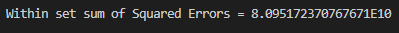
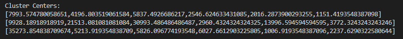

### :necktie: Student
 Name: José Miguel Aguilar López  
 Career: Ing. Sistemas Computacionales

### :necktie: Student
Name: José Ivan Torres Negrete  
Career: Ing. Sistemas Computacionales

### :necktie: Student
Name: Damaris Villegas Carmona  
Career: Ing. Sistemas Computacionales

## Instructions
**Develop the following instructions in Spark with the Scala programming language**

## Objective:
**The goal of this practical exam is to try to group customers from specific regions from a wholesale distributor. This is based on the sales of some product categories.**

**Import a simple spark session**  
    
    import org.apache.spark.sql.SparkSession

**Minimize the errors with code**
    
    import org.apache.log4j._Logger.getLogger("org").setLevel(Level.ERROR)

**Create an instance for the spark session**
        
    val spark = SparkSession.builder().getOrCreate()

**Import the Kmeans library**
    
    import org.apache.spark.ml.clustering.KMeans

**Load the dataset from the csv file**
        
    val data = spark.read.option("header", "true").option("inferSchema","true")csv("C:/Users/JOSE/Desktop/unidad3/Wholesale customers data.csv")
    data.show()

**select the following columns: Fresh, Milk, Grocery, Frozen, Detergents_Paper, Delicassen and call this set as feature_data**

    val feature_data = data.select("Fresh", "Milk", "Grocery", "Frozen", "Detergents_Paper", "Delicassen")
    feature_data.show()
**Import Vector Assembler y Vector**
    
    import org.apache.spark.ml.feature.VectorAssembler
    import org.apache.spark.ml.linalg.Vectors

**create a new object Vector Assembler for the features columns as an input set**
    
    val assembler = new VectorAssembler().setInputCols(Array("Fresh", "Milk", "Grocery", "Frozen", "Detergents_Paper", "Delicassen")).setOutputCol("features")

**Use the object assembler to transform feature_data**

    val features = assembler.transform(feature_data)

**Create the kmean model with k = 3**

    val kmeans = new KMeans().setK(3).setSeed(1L)
    val model = kmeans.fit(features)

**evaluate the groups using Within Set Sum of Squared Errors WSSSE and print the centroids.**

    val WSSE = model.computeCost(features)
    println(s"\n\nWithin set sum of Squared Errors $WSSE\n\n")

    println("Cluster Centers: ")
    model.clusterCenters.foreach(println)
    spark.stop()

